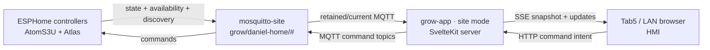

# Grow App Phase 1

Implementation plan · site-mode HMI v1

**Scope:** Build `grow-app` v1 as the LAN-local site-mode HMI/API for
Daniel's grow site. **Framework:** SvelteKit + Svelte 5 + TypeScript.
**Broker:** Daniel's site Mosquitto at `grow/daniel-home/#`.
**Status:** <span class="badge badge-decided">deployed locally + OTA updates shipped</span>

## Outcome

Phase 1 proves the local control path end to end:



The browser never connects directly to Mosquitto. `grow-app` owns one
server-side MQTT session, derives the entity model from retained discovery, and
mediates all reads and writes over HTTP/SSE.

## Current implementation status

Phase 1 app code exists in `/home/daniel/dev/grow-app` and the local MQTT path
has been proven against Daniel's broker: discovery-derived devices/entities,
retained/current state seeding, SSE updates, mediated command publishing, and
dangerous-action confirmation. The production image is published from
`stackdrift/grow-app` and deployed as Daniel's LAN-local `media-stack/grow`
service on port `3080`.

Channel-aware firmware updates are also shipped for site mode. `grow-fleet`
publishes private GHCR OCI firmware packages under
`ghcr.io/dephekt/grow-fleet-firmware-*`; `grow-app` resolves the selected
stable/edge channel, serves the local ESPHome update manifest and
checksum-validated binary proxy, and publishes the non-retained MQTT update
command from Device Settings.

The next HMI iteration is the Mission Control redesign tracked in
[Grow app UI redesign workflow](grow-app-ui-redesign.md). That work is
post-Phase-1 polish and expansion: it should reuse the shipped Phase 1
MQTT/SSE/current-state architecture first, then add history, trends, and
substrate/Pulse-class surfaces only after their backing contracts exist.

The next architecture step after Phase 1 is no longer a separate central grow
console. Each site remains its own grow-app deployment. Remote access should
route to the same site app at `<site-slug>.grow.dephekt.net`, while grow-app
itself owns login, OIDC callbacks, local sessions, bootstrap admin access, and
local fallback passwords. Time-series history also belongs beside the site app:
InfluxDB plus a local MQTT history recorder, queried through grow-app server
routes.

## Done

- Site-mode SvelteKit/Svelte 5 app scaffolded and deployed on LAN port `3080`.
- Server-side MQTT session, retained/live entity cache, SSE snapshots, and HTTP
  command mediation are implemented.
- Device settings are split from the high-frequency dashboard and grouped by
  retained UI metadata.
- Dangerous command handling requires explicit browser confirmation and a
  server-side `confirm` flag.
- Firmware update discovery/orchestration is implemented for current devices:
  app-owned channel selection, stable/edge package lookup, local manifest and
  binary proxy, update-check trigger, and per-device Apply flow.
- The app image moved with the repo and now publishes as
  `ghcr.io/dephekt/grow-app:edge-node24-bookworm-slim`.

## Still To Do

- Polish the HMI information architecture and visual hierarchy so the
  operations overview stays scan-friendly as entity counts grow.
- Validate the physical Tab5/kiosk ergonomics with real touch use, not only
  simulated viewports.
- Implement the Mission Control overview/settings direction from
  [Grow app UI redesign workflow](grow-app-ui-redesign.md), starting with the
  visual system and curated settings surfaces that can run on today's retained
  MQTT snapshot.
- Implement app-owned auth, per-site remote access, local InfluxDB history,
  AC Infinity/Pulse bridges, substrate sensing, and `grow-rules` in later
  phases.
- Keep firmware-update follow-ups separate from HGC-4: HGC-18 tracks edge
  publish path filters/concurrency, and HGC-19 tracks custom ESPHome update
  install payload support.

## In Scope

- Scaffold `/home/daniel/dev/grow-app` as SvelteKit, Svelte 5, TypeScript, and
  `@sveltejs/adapter-node`.
- Pin package-manager metadata to `pnpm@11.5.3` and commit `pnpm-lock.yaml`.
- Lift the Svelte 5 guardrail from the grow-control brief into
  `grow-app/AGENTS.md`.
- Enable ESPHome MQTT discovery for AtomS3U and Atlas under the site-scoped
  prefix `grow/daniel-home/_discovery`.
- Add a site broker user `grow-app-site-daniel-home`, backed by
  `MQTT_GROW_APP_SITE_PASSWORD`, with `readwrite grow/daniel-home/#`.
- Build the local HMI first screen: broker/site health, device availability,
  device cards, live values, and writable controls.
- Expose all discovered writable controls that have MQTT command topics.
- Require explicit confirmation before publishing dangerous or momentary actions
  such as restart, calibration, clear calibration, and factory reset.
- Publish `grow-app` as `ghcr.io/dephekt/grow-app` via GitHub Actions.
- Deploy Daniel's local HMI as a separate `media-stack/grow` compose stack on
  LAN port `3080`, attached to the MQTT stack through the shared `grow-mqtt`
  Docker network.

## Out of Scope

- App-owned login, per-site OIDC clients, local fallback passwords, and remote
  access through `<site-slug>.grow.dephekt.net`.
- Time-series history and charts backed by local InfluxDB.
- AC Infinity and Pulse bridges.
- `grow-rules`.
- Retained app command publishes. Phase 1 command publishes are not retained;
  retained setpoint semantics are revisited when setpoints are separated from
  momentary actions.

## MQTT Contract

Site mode uses these defaults:

| Setting | Value |
|---|---|
| Site | `daniel-home` |
| State namespace | `grow/daniel-home/#` |
| Discovery prefix | `grow/daniel-home/_discovery` |
| App broker user | `grow-app-site-daniel-home` |
| App password secret | `MQTT_GROW_APP_SITE_PASSWORD` |
| Local HMI port | `3080` |
| App image | `ghcr.io/dephekt/grow-app:edge-node24-bookworm-slim` |

Server responsibilities:

1. Subscribe to `grow/daniel-home/#`.
2. Parse retained ESPHome/Home Assistant MQTT discovery payloads under
   `grow/daniel-home/_discovery/#`.
3. Cache entity metadata, retained/current state, and device availability.
4. Stream snapshots and updates to browsers over SSE.
5. Publish command requests only to discovered command topics.

Public local interfaces:

| Method | Path | Purpose |
|---|---|---|
| `GET` | `/health` | Broker/app liveness for local deploy checks |
| `GET` | `/api/snapshot` | Current broker, device, entity, and state cache |
| `GET` | `/api/events` | SSE stream for snapshot/update events |
| `POST` | `/api/entities/:entityId/command` | Mediated writes to command topics |

## UI Requirements

The first route is the HMI, not a landing page. It should fit a Tab5 kiosk and
LAN phones while remaining usable on desktop:

- Status strip for site, broker connection, last update, and entity/device
  counts.
- Device cards grouped by discovery device metadata.
- Live value rows for sensors and binary sensors.
- Writable controls for `switch`, `number`, `select`, `button`, and other
  discovered command-topic entities.
- Offline/stale states visible without hiding the last known value.
- Confirmation before dangerous actions. The server should also require a
  confirmation flag for entities classified as dangerous.

## Verification

Docs:

```bash
mkdocs build --strict
```

ESPHome/MQTT:

```bash
./docker/esphome compile configs/test-atoms3u-sensors.yaml
./docker/esphome compile configs/atlas-hydro-kit.yaml
```

Expected broker observations after flashing or restart:

- Discovery appears under `grow/daniel-home/_discovery/#`.
- Live state and status remain under `grow/daniel-home/#`.

App:

```bash
pnpm install --frozen-lockfile
pnpm check
pnpm test
pnpm build
pnpm exec playwright install chromium
pnpm test:e2e
docker build -t grow-app:test .
```

Deployment:

```bash
make inject-secrets
make inject-agent-secrets
make sync-secrets-media
make mqtt-up
make grow-up
curl http://<media-server-LAN-IP>:3080/health
```

Acceptance:

- App loads on LAN without Keycloak in Phase 1. A later auth phase intentionally
  changes this to app-owned login with local fallback credentials.
- AtomS3U and Atlas appear from discovery.
- Retained state renders immediately on load.
- SSE updates live values without a page refresh.
- Writable controls publish to the discovered MQTT command topics.
- Dangerous actions publish only after explicit confirmation.

## Local deployment acceptance

Accepted on June 13, 2026 against `http://192.168.8.3:3080`:

- `grow-app-site` and `mosquitto-site` were healthy on the `media-server`
  Docker context.
- `/health` returned broker `connected: true`, 2 devices, and 122 entities.
- LAN browser load made no Keycloak/OIDC requests and rendered both Atlas Hydro
  Monitor and AtomS3U Sensor Rig.
- SSE delivered an initial retained snapshot and live state events; the HMI
  last-update timestamp changed without refresh.
- A non-dangerous select control published `rainbow` to
  `grow/daniel-home/atoms3u-sensor-rig/select/thermal_color_palette/command`.
- A dangerous restart command without confirmation returned
  `409 Confirmation required for this command`, and the browser raised a
  confirmation dialog for a dangerous button.

## Live HMI acceptance sweep

Accepted on June 13, 2026 after internal user access was confirmed:

- `grow-app-site` and `mosquitto-site` remained healthy on `media-server`;
  `/health` returned broker `connected: true`, 2 devices, and 122 entities.
- Desktop viewport (`1440x900`) and phone viewport (`390x844`) both loaded
  `http://192.168.8.3:3080` with no Keycloak/OIDC requests, no console errors,
  no horizontal overflow, broker `Connected`, 2 device cards, 45 writable
  controls, and 19 dangerous buttons.
- Live SSE behavior was visible in the HMI: the last-update timestamp changed
  without a page refresh in both tested viewports.
- UI command mediation was verified with the safe `CO2 High Threshold` number
  control by re-submitting its current value; MQTT received `1500` on
  `grow/daniel-home/atoms3u-sensor-rig/number/co2_high_threshold/command`.
- Dangerous command protection was verified by canceling a dangerous button
  confirmation in the browser and by confirming the restart endpoint still
  returns `409 Confirmation required for this command` when `confirm` is absent.

## Remaining Phase 1 polish backlog

Priority order before larger Phase 2 work:

1. Improve HMI scanability for 129+ entities: group or collapse diagnostic rows,
   surface the most important live readings first, and make writable controls
   easier to find without scrolling through every discovered entity.
2. Make dangerous controls visually and spatially distinct from ordinary
   writable controls; keep the existing client confirmation and server-side
   `confirm` requirement.
3. Validate the layout on the physical Tab5 or intended kiosk device. Simulated
   phone/desktop viewports are clean, but physical touch targets and kiosk
   ergonomics still need real-device notes.

## Remaining firmware update backlog

- Site-mode Settings -> Device updates is implemented for per-device updates.
- Future remote access should reach the target site's grow-app through the
  public site hostname. Update operations stay mediated by that local app/hub
  rather than requiring the browser to reach controllers directly.
- HGC-18: add grow-fleet edge publish path filters and a concurrency guard.
- HGC-19: support custom ESPHome update install payloads if a future device
  exposes one instead of the default `INSTALL`.
- Consider batch/"Apply all" UX after per-device update behavior has more live
  mileage.
