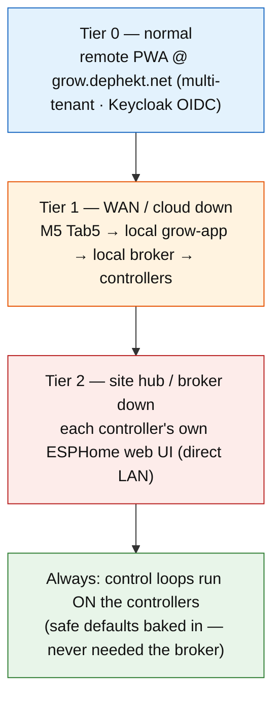
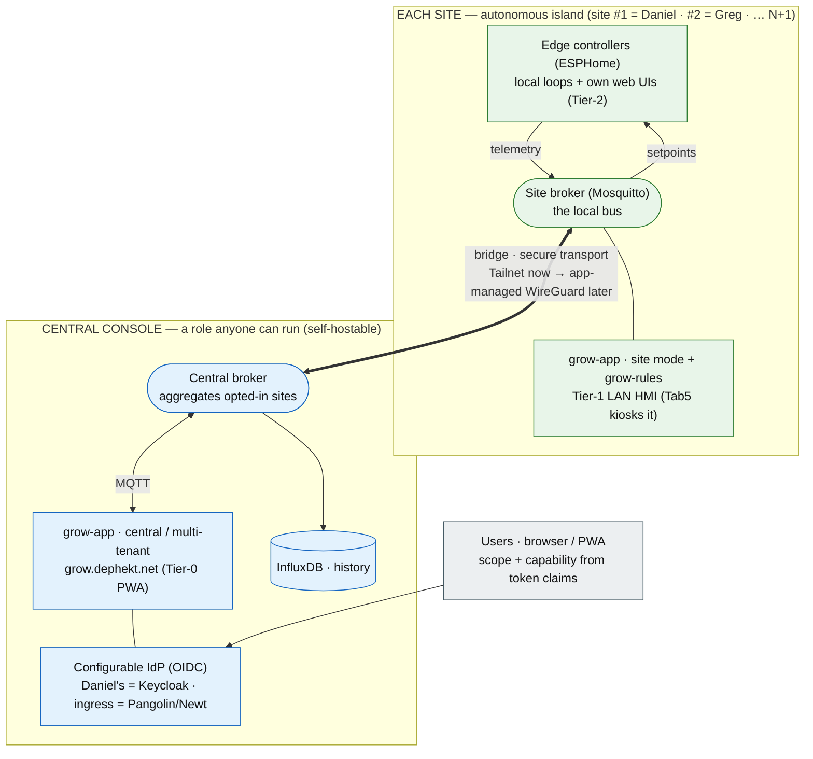
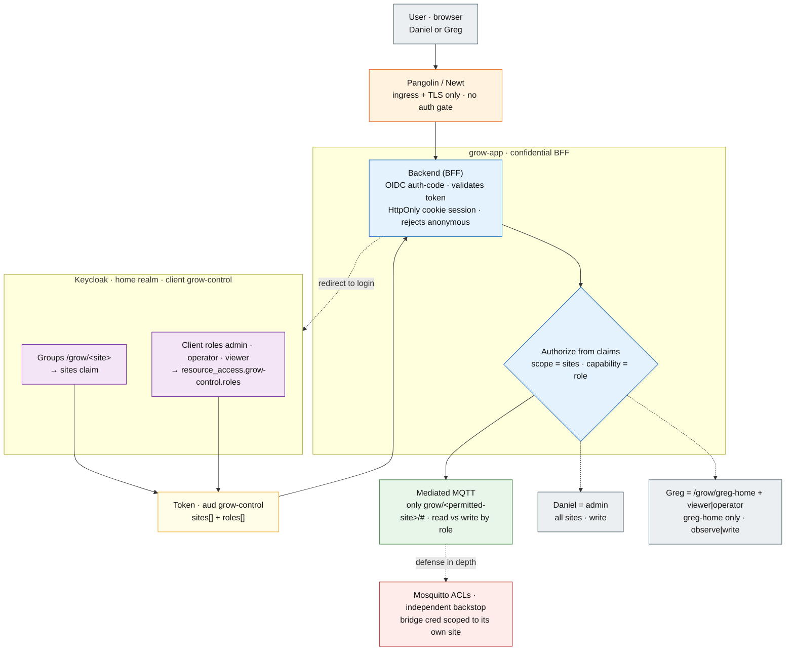

# Grow Control System

Design brief · phase 1 planning artifact

**Scope:** Replace Home Assistant as the grow frontend with an MQTT-based,
multi-site, industrial-style control system. **Sites:** Daniel (home) + Greg
(remote, mirrored). **Remote/UI:** multi-tenant PWA at `grow.dephekt.net`.
**Status:** Phase 0 complete → Phase 1 planning

## About this document

!!! note ""
    Self-contained design brief for the grow control system. A downstream
    planning agent (or future-me) should be able to read this end-to-end and
    derive a build plan without recovering context from chat. It follows four
    moves:

    1.  **Establish context** — why move off HA, and the framing principle.
    2.  **Pin decisions** — choices already made, with rationale.
    3.  **Surface the shape** — topology, layers, the MQTT/auth/fleet planes.
    4.  **Track open threads** — the forks still to resolve before the relevant
        implementation phase.

## Status snapshot

!!! note ""
    **Decisions pinned:** 25  ·  **Open forks:** 3  ·  **Deferred / out of scope:** 5
    ·  **Phases sketched:** 7

    **Status:** architecture shape agreed; symmetric N+1 sites + a self-hostable
    central console pinned; client/auth strategy affirmed (confidential BFF +
    server-capable framework — SvelteKit/Svelte 5, configurable IdP).
    **Phase 0 is complete:** Daniel's site broker + central broker are deployed
    as the `media-stack/mqtt` Mosquitto stack with a site-to-central bridge, and
    ESPHome configs now publish under `grow/daniel-home/#`. No `grow-app` code
    has been written yet. Next concrete step is a real Phase 1 implementation
    plan for `grow-app` v1 in site mode. See
    [Grow app Phase 1](grow-app-phase-1.md).

------------------------------------------------------------------------

## 1. Goal & context

Home Assistant is being dropped as the **high-level frontend**. The friction is
specifically its **automations** and **dashboards** at the customization level
this needs. HA actually conflates three concerns; only two are the problem:

| Concern | What it is | HA today | Verdict |
|---|---|---|---|
| Transport / state bus | the message fabric | HA's Mosquitto add-on | keep the *function*, own it (it's just MQTT) |
| Control logic / automations | "if VPD>X do Y", crop steering, schedules | HA automations (painful) | **replace** |
| Presentation | dashboards | Lovelace (painful) | **replace** |

Key separation: **MQTT discovery and "using HA" are independent.** Controllers
can keep emitting HA discovery (so an HA instance *could* attach for a glance or
voice) while HA is **not in the critical path** — an optional observer, not a
dependency.

The end state: a "more industrial control system" — collapse layers down to the
ESPHome / ESP-IDF edge, an MQTT spine, a small purpose-built supervisory layer,
and a touch-friendly PWA (phone + M5Stack Tab5) at `grow.dephekt.net` —
Pangolin/Newt for ingress, the app itself authenticating users via Keycloak OIDC.

!!! note "Positive framing — an open, self-hostable Pulse"
    The model to beat is **Pulse Grow**: hubs + ESP-based sensors + a slick app,
    but **cloud-only** — network down means no local management and data gaps,
    purely to enforce vendor lock-in (their devices *could* speak MQTT to your
    own broker; they won't, because lock-in is the business). This system is the
    open inversion: sensors on open controllers that do C2 through a **local**
    broker and keep working offline, with an **opt-in** uplink to a rich central
    console. The console is **self-hostable** — anyone can clone the repos, run
    their own on a VPS, and point their site at it (or at nobody). Anti-lock-in
    is the thesis, not a feature.

## 2. Organizing principle — autonomous site islands

Borrowed from real SCADA/PLC practice: the **control loop runs at the edge**,
close to the sensors/actuators, so the process survives the network, the app,
and the operations center going down. The supervisory layer only sets
**setpoints** and **observes**.

Two consequences that shape everything:

- **Each *site* is an autonomous control island.** Greg's grow must keep running
  if Daniel's house, the WAN, or Pangolin is down. The central hub is an
  *operations console*, not a runtime dependency.
- **A clean degradation ladder** falls out of this:

## 3. Topology

**Symmetric: N+1 autonomous site islands + one central console *role*.** Every
site is the same shape — edge controllers + a local broker + grow-app (site
mode) + grow-rules — and bridges, *if it opts in*, up to a central console over
a secure transport. No site is special. The "central console" (aggregator
broker + grow-app central + history + IdP) is a **role anyone can run**, not a
fixed dependency: Daniel runs one for himself + Greg; a stranger can self-host
their own; a site can run with no console at all.

Daniel's site stack and the console **co-locate on media-server today** (as
separate containers, bridged over loopback); lifting his site stack to
dedicated hardware (the repurposed HA Pi 4) later is a pure deploy-target change
over a remote Docker context — at which point his site looks exactly like
Greg's. The collapse is a *deployment detail*, never the architecture.

## 4. Layers & components

- **Edge (per site):** ESP32/ESPHome controllers own sensors + actuators, run
  the local control loop, serve their own `web_server` UI, and speak MQTT
  (discovery + LWT). The existing AtomS3U bench rig (CO2L/MLX90640/QMP6988) is
  the prototype.
- **Bus (per site + central):** Mosquitto. A **site-local broker** per site for
  autonomy; the **central broker** on media-server aggregates via bridge.
- **Site hub (per site):** a cheap always-on box (Pi 5 / N100) running local
  Mosquitto + `grow-app` (site mode) + `grow-rules`. Daniel's media-server
  doubles as his site hub.
- **Supervisory (central):** `grow-app` (central/multi-tenant), InfluxDB
  (history/analytics), fleet management, Keycloak (OIDC) + Pangolin (ingress).
- **Presentation:** the PWA (`grow.dephekt.net`, Keycloak OIDC) for remote; the Tab5
  kiosking the *local* `grow-app` for Tier-1 on-site; controller web UIs for
  Tier-2.

**One app, two deploy modes.** `grow-app` is a single codebase:

- **Site mode** — local broker, single site, LAN-only, on the site hub. The
  Tab5 + on-LAN phones use this. Survives WAN loss.
- **Central mode** — aggregated broker, multi-tenant, at `grow.dephekt.net`
  (Pangolin ingress; app authenticates via Keycloak OIDC). For remote access.

No second native UI for the Tab5; it is "just a screen" for the local instance.

## 5. The control plane — MQTT

- **Contract = ESPHome's native MQTT conventions.** ESPHome's `mqtt:` already
  gives per-entity state topics, command topics for controllable entities,
  birth/will (LWT) availability, and optional HA discovery — all free. Adopt
  that as the system contract; make the **bridges conform** to the same shape.
- **Topic namespace carries the site:** `grow/<site>/<device>/…` with
  `<site>` ∈ {`daniel-home`, `greg-home`}. Load-bearing for multi-tenancy.
- **Setpoints are retained** so a rebooting controller/app recovers desired
  state; LWT marks devices offline (fixes the gap in the Pulse pattern, which
  leans on HA's timeout).
- **Bridges** (for non-ESP-native gear) publish the same shape:
    - **AC Infinity** — a standalone bridge lifting `ACInfinityClient`.
    - **Pulse Labs** — the AppDaemon app rewritten as a plain MQTT publisher.

## 6. Multi-tenancy & access (two planes)

!!! note ""
    Auth governs the **remote** path only. Local on-LAN access to each site is
    **IdP-free** (decision 20): the Tab5 kiosk and on-LAN phones reach the
    site-mode app + local broker with no Keycloak dependency, so a site keeps
    running WAN-down. The two planes below govern remote and inter-site access.
    The central app authenticates against a **configurable** OIDC provider
    (decision 23) — Keycloak is *Daniel's* instance's choice, not a hardcoded
    dependency; a self-hoster points at their own.

- **Human plane = Keycloak OIDC (confidential BFF client).** `grow-app` is its
  own Keycloak client (`grow-control`, `home` realm) — a **confidential
  BFF**: the backend does the auth-code exchange and holds tokens server-side;
  the browser gets an HttpOnly cookie session. Pangolin/Newt provides ingress +
  TLS only (`auth.sso-enabled` is dropped; the app must reject anonymous
  requests itself). Two claim axes: **scope** = Keycloak groups `/grow/<site>`
  surfaced as a `sites` claim (group-membership mapper); **capability** =
  client roles `admin`/`operator`/`viewer` in
  `resource_access.grow-control.roles`. Greg = group `/grow/greg-home` + a
  role (open: `viewer` vs `operator`); Daniel = `admin` role = all sites. The
  app enforces *which site* and *what you can do* from the validated token —
  not from forwarded headers. `grow-control` appears in users' Keycloak
  Account Console Applications list ("Always display in console", home URL
  `https://grow.dephekt.net`) — a launcher, not itself an access boundary.
- **Machine plane = Tailscale.** Greg's site-local Mosquitto **bridges**
  `grow/greg-home/#` up to the central broker (telemetry up, setpoints down)
  over Tailscale — encrypted, NAT-traversing, no port-forwarding. If the link
  drops, Greg's island keeps running and the bridge reconnects.
- **Defense in depth = broker ACLs.** Greg's bridge credential can only touch
  `grow/greg-home/#`, so a tenant-isolation bug in the app can't leak
  cross-site.

The access decision, end to end:

## 7. Fleet & firmware (GitOps for ESPHome)

- **Shared package + per-device substitutions.** A common `grow-controller`
  ESPHome package (from the `esphome-components` monorepo) included by a thin
  per-device YAML that only sets substitutions (`site`, `device_id`,
  `environment`, I²C addresses, wifi secret ref). "Mirrored setups" = identical
  packages, per-site substitutions.
- **Git is the source of truth;** an ESPHome dashboard on each site hub pulls +
  OTA-flashes its local devices; Daniel reaches Greg's over Tailscale. Per-site
  `secrets.yaml` (wifi) lives on the hub, never in git.
- **Provisioning Greg:** flash proven firmware at Daniel's first, ship/install,
  connect wifi (improv / per-site secret). "Buy the same sensors, flash, plug
  in."

## 8. Reuse vs rebuild

| Keep / own | Reuse (don't rewrite) | Ditch |
|---|---|---|
| Mosquitto (own the broker) | AC Infinity `ACInfinityClient` → bridge | HA as frontend |
| HA MQTT discovery as an *optional* shim | Pulse discovery/device modeling → standalone bridge | HA automation engine |
| ESPHome `web_server` local UIs (already have) | ESPHome components (mlx90640, scd4x_*, ezo_types, grow_env_monitor) | HA as a hard dependency |
| Tailscale + Pangolin/Keycloak (already run) | The AtomS3U bench rig as prototype | (later) AC Infinity's cloud role |

------------------------------------------------------------------------

## 9. Decisions pinned

1.  decided Drop HA as frontend **and** as the automation engine.
2.  decided Own the MQTT broker (Mosquitto); it's the system spine.
3.  decided Keep HA MQTT discovery as an optional compatibility shim; HA never in the critical path.
4.  decided Control loops run at the **edge** (ESPHome); supervisory layer only sets setpoints + observes.
5.  decided Each **site** is an autonomous control island; central = operations console; no site depends on central to run.
6.  decided MQTT contract = ESPHome's native MQTT conventions; bridges conform to it.
7.  decided Per-controller ESPHome `web_server` UI is the guaranteed Tier-2 fallback (already in use).
8.  decided **One** `grow-app` codebase, two deploy modes (site/local + central/multi-tenant).
9.  decided Tab5 = Tier-1 local HMI; it kiosks the **local** grow-app instance. No second native UI.
10. decided Per-site hub (mini-PC) runs local Mosquitto + grow-app(site) + grow-rules; Daniel's media-server doubles as his hub.
11. decided Cross-site link = Mosquitto bridge over **Tailscale** (machine plane); Pangolin/Newt = human remote **ingress** (TLS + tunnel); auth is the app's own Keycloak OIDC, not a proxy gate.
12. decided Tenant = site/owner; namespace `grow/<site>/…`; Keycloak **groups** = site scope (`sites` claim), **client roles** (`admin`/`operator`/`viewer`) = capability; Mosquitto ACLs for isolation.
13. decided `grow-rules` (crop steering / irrigation) runs **per-site on the hub** for autonomy; configured/observed centrally.
14. decided Fleet = GitOps ESPHome packages + per-device substitutions; per-site dashboard over Tailscale; secrets per-site, not in git.
15. decided "Environment" is logical + nestable (room → tents); device→environment mapping is **soft** (app config); firmware publishes by stable device id.
16. decided Integrate AC Infinity now via a lifted-client MQTT bridge — caveat it's cloud-only + poll-only (the soft spot); flag eventual replacement with ESP-driven local control.
17. decided Rewrite Pulse as a standalone MQTT bridge (drop AppDaemon/HA).
18. decided Time-series = InfluxDB (central) for history/charts; "current state" from retained MQTT (so TS can be deferred).
19. decided Human auth = grow-app is a confidential **BFF** Keycloak OIDC client (`grow-control`, `home` realm); Pangolin drops `auth.sso-enabled` and serves ingress only; the app appears in users' Keycloak Applications list and enforces access from token claims.
20. decided **Local site access is IdP-free; Keycloak gates only the remote inbound path *into* a site.** Remote access = the central `grow.dephekt.net` BFF, which reaches each site via the aggregating broker + Tailscale bridge. On-LAN access to a site — Tab5 kiosk + on-LAN phones → site-mode `grow-app` → local broker — has no IdP dependency (physical/LAN access is the trust boundary). Required for Tier-1 autonomy: a WAN outage must never lock a site out of its own controls, and a remote site (Greg) cannot depend on the central Keycloak to run locally. Sharpens decisions 5, 11, 19.
21. decided `grow-app` is a **server-capable framework** (the confidential BFF backend), **not** a static SPA + separate API. The backend is already stateful (persistent MQTT client, retained-state cache, SSE/WS fan-out), so tokens live server-side and the browser holds only an HttpOnly session cookie. This also makes the site-mode/central-mode auth difference a single server-side toggle (decision 20). Which specific framework (Next vs SvelteKit) remains open — see fork 3.
22. decided **No site is special — symmetric N+1.** Every site (Daniel's included) is the same unit: edge + local broker + grow-app(site) + grow-rules, optionally bridging up to a central console. The console is co-located on media-server *today* (separate containers, loopback bridge) but is a distinct **role**, liftable — Daniel's site stack moves to dedicated HW (the repurposed HA Pi 4) via a remote Docker context, making his site identical to Greg's and isolating his grow from media-server maintenance. Resolves the collapsed-vs-symmetric topology question and fork 4.
23. decided **The central console is a self-hostable role — federation is a pinned goal.** OSS repos; anyone can run their own console on a VPS and point a site at it (or at no console). Forces: the central app authenticates against a **configurable** OIDC provider (not a hardcoded Keycloak), the site↔console link is generic (any endpoint), and the shared units carry no dephekt-specific assumptions. Anti-lock-in is the thesis — the open inversion of Pulse Grow.
24. decided **Config-as-source-of-truth; the UI is a generator over it.** Central-management settings (remote broker endpoint + creds, IdP info, site identity) are a declarative config (YAML or similar) that the app consumes. A "Remote Management" area in grow-app gives regular users a rich UI to enter them; power users / automated deploys hand-author or supply the config file directly. Both paths converge on the same generated artifact — the UI never becomes a second source of truth.
25. decided **grow-app frontend = SvelteKit (Svelte 5).** Resolves fork 3. Chosen over Next.js for lower boilerplate (a non-frontend owner can read and maintain the source), language-native reactivity that suits live MQTT telemetry (a value arriving → the UI updating is nearly free), and lighter bundles for the Tab5 kiosk + phones. The one real cost — coding agents blending deprecated Svelte 4 idioms with Svelte 5 **runes** — is mitigated by a Svelte-5-only guardrail lifted into grow-app's `AGENTS.md` at scaffold time (see §14) plus a pinned `svelte@^5` major. The server-capable BFF architecture (decision 21) is unchanged: SvelteKit *is* the server, in two run-modes (decision 8).

## 10. Open threads / forks

1.  open **Site-hub hardware** — Pi 5 vs N100 mini-PC (N100 can also host an edge Influx buffer; Pi is cheaper/lower-power). Applies to Daniel too now (decision 22): the repurposed HA **Pi 4** is the leading candidate for his site hub, which also retires HA on that box.
2.  open **Remote write vs read-only** — does the cloud PWA write setpoints into a *remote* site, or observe-only when remote? (Affects what the bridge carries down.) — maps to the `operator` (write) vs `viewer` (observe) role for a remote tenant.
3.  resolved **grow-app framework — SvelteKit (Svelte 5).** Resolved by decision 25. Both finalists were server-capable (BFF pinned, decision 21); SvelteKit won on lower boilerplate, native reactivity fit for live telemetry, and lighter bundles for the Tab5. Agent Svelte-4/5 idiom-mixing is mitigated by the §14 guardrail + pinned Svelte major.
4.  resolved **Central-broker resilience** — resolved by decision 22: each site (incl. Daniel's) runs its own local broker, so the central role can co-locate now and lift later; a media-server reboot affects only aggregation/remote, never a site's local control. Still worth an explicit test once the Pi-4 lift happens.
5.  open **AC Infinity takeover depth** — front the cloud as-is vs progressively replace its fan/relay role with local ESP control (ties to decision 16).

## 11. Out of scope (for now)

- deferred Crop-steering / irrigation **algorithms** (VPD curves, dryback targets, schedules) — pinned until the bus + app shape is real. The seam is clean: `grow-rules` just publishes setpoints.
- deferred Replacing AC Infinity hardware with ESP-driven fans/relays.
- later Voice assistants / HA-app niceties (possible later via the discovery shim).
- later Live camera/video UI (the MLX thermal is sensor telemetry; streaming is separate).
- later Billing / seat management beyond a Keycloak group for Greg.

## 11.5. Maintenance notes

- deferred **Atlas EC calibration entity
  names before ESPHome 2026.7.0:** `configs/atlas-hydro-kit.yaml` currently has
  `EC Cal Low (1413 µS/cm)` and `EC Cal High (5000 µS/cm)`. ESPHome 2026.5.1
  warns that ASCII `/` is reserved as a URL path separator and auto-rewrites it
  to Unicode fraction slash `⁄`; this becomes a hard error in ESPHome 2026.7.0.
  Rename those labels to use `µS⁄cm` explicitly before upgrading ESPHome.

## 12. Phase plan

- **Phase 0 — site broker + edge telemetry.** done
  Stand up Daniel's **site broker**
  on media-server (+ the central broker and a loopback bridge, so the full
  topology is exercised from day one); add `mqtt:` (discovery + LWT) to the
  AtomS3U rig pointed at the site broker (`grow/daniel-home/#`); prove telemetry
  flows + retained setpoints round-trip.
- **Phase 1 — grow-app v1 (site mode).** next
  Subscribe local broker → SSE/WS →
  minimal responsive PWA; run on media-server (Daniel's site = central). Tab5
  kiosks it. Prove local monitoring + control. Detailed implementation plan:
  [Grow app Phase 1](grow-app-phase-1.md).
- **Phase 2 — central / multi-tenant + remote.** Central mode + `grow.dephekt.net`
  behind Pangolin ingress with Keycloak OIDC (`grow-control` client; groups +
  roles); the environment data model (room → tents; soft device→env mapping).
- **Phase 3 — bridges.** AC Infinity (lift client) + Pulse (rewrite), both
  emitting the ESPHome MQTT shape + discovery.
- **Phase 4 — Greg's site.** Site hub (local Mosquitto + grow-app + bridge over
  Tailscale), Keycloak seat (group `/grow/greg-home` + role) + tenant scoping,
  mirrored hardware shipped/flashed.
- **Phase 5 — fleet + history.** GitOps firmware (packages + per-site dashboard);
  InfluxDB history/charts.
- **Phase 6 — grow-rules.** Crop steering / irrigation per-site on the hub.

------------------------------------------------------------------------

## 13. Pointers & references

- **ESPHome monorepo:** `git@codeberg.org:stackdrift/esphome-components.git` —
  components (mlx90640, scd4x_alerts/stats, ezo_types, grow_env_monitor,
  m5cores3_*) + the AtomS3U bench config + the local dev loop. PR flow via `cb`.
- **Pulse pattern:** `~/dev/pulse-sensors-appdaemon` — device-level HA discovery
  (`homeassistant/device/<id>/config`), `via_device` hub→sensor model,
  read-only, **no LWT** (to improve in the rewrite).
- **AC Infinity:** `~/dev/homeassistant-acinfinity` — `ACInfinityClient`
  (`client.py`, pure `aiohttp`, no HA deps), cloud-only (`acinfinityserver.com`),
  email+password → `appId` token, **poll-only**, writes via
  `update_device_controls()`/`update_device_settings()`; modes off/on/auto/timer/
  cycle/schedule/vpd. Liftable into a bridge.
- **Docker / edge:** `~/docker` — `core` stack runs Newt + Keycloak; resources
  exposed via `pangolin.proxy-resources.*` labels on the external `proxy`
  network; context `media-server`. **No MQTT broker exists yet** — add one.
  `grow.dephekt.net` uses the Pangolin routing labels **without**
  `auth.sso-enabled` (ingress only) — auth is handled in-app via a Keycloak
  `grow-control` confidential client (redirect URIs under
  `https://grow.dephekt.net/`, group-membership + client-role mappers,
  "Always display in console").
- **Planes:** Tailscale (machine/MQTT bridge + fleet OTA), Pangolin/Newt
  (human remote ingress) + Keycloak (OIDC auth), media-server (central host).

------------------------------------------------------------------------

## 14. grow-app frontend conventions — Svelte 5 / SvelteKit

Lift the block below into grow-app's `AGENTS.md` (and echo the headline in its
README) the moment the repo is scaffolded. Its sole job is to neutralize the one
cost of choosing Svelte (decision 25): agents trained on a blend of Svelte 4 and
5 sometimes emit deprecated idioms that "work" in dev but aren't idiomatic and
rot fast.

!!! note "AGENTS.md — Svelte 5 guardrail (ready to lift)"
    **Svelte 5 (runes mode) + SvelteKit only. Never mix Svelte 4 idioms.**
    Before writing any component, confirm `svelte@^5` in `package.json`. Use only
    the right-hand column:

    | Concern | ✅ Svelte 5 | ❌ Svelte 4 (never) |
    |---|---|---|
    | Local reactive state | `let n = $state(0)` | bare `let n = 0` treated as reactive |
    | Derived value | `let d = $derived(n * 2)` | `$: d = n * 2` |
    | Side effect | `$effect(() => { … })` | `$: { … }` reactive block |
    | Props | `let { foo } = $props()` | `export let foo` |
    | Two-way prop | `$bindable()` | implicit `export let` binding |
    | Event handler | `onclick={fn}` | `on:click={fn}` |
    | Child content | `{#snippet}` + `{@render children()}` | `<slot />` |
    | Component events | callback props | `createEventDispatcher` |

    - Shared cross-component state: runes in a `.svelte.js` / `.svelte.ts` module,
      not ad-hoc stores. `svelte/store` stays valid where a store is genuinely the
      right tool — reach for runes first.
    - If you catch yourself typing `$:` or `export let`, stop — that's Svelte 4.
    - Canonical syntax source: the official Svelte 5 docs (svelte.dev/docs;
      svelte.dev/llms.txt for an LLM-oriented dump) — not pre-2024 blog posts or
      training-memory.
    - Pin `svelte` to a `^5` major; never float it backward.
