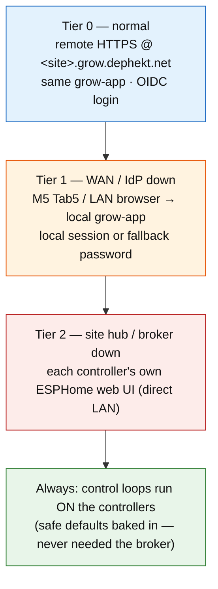
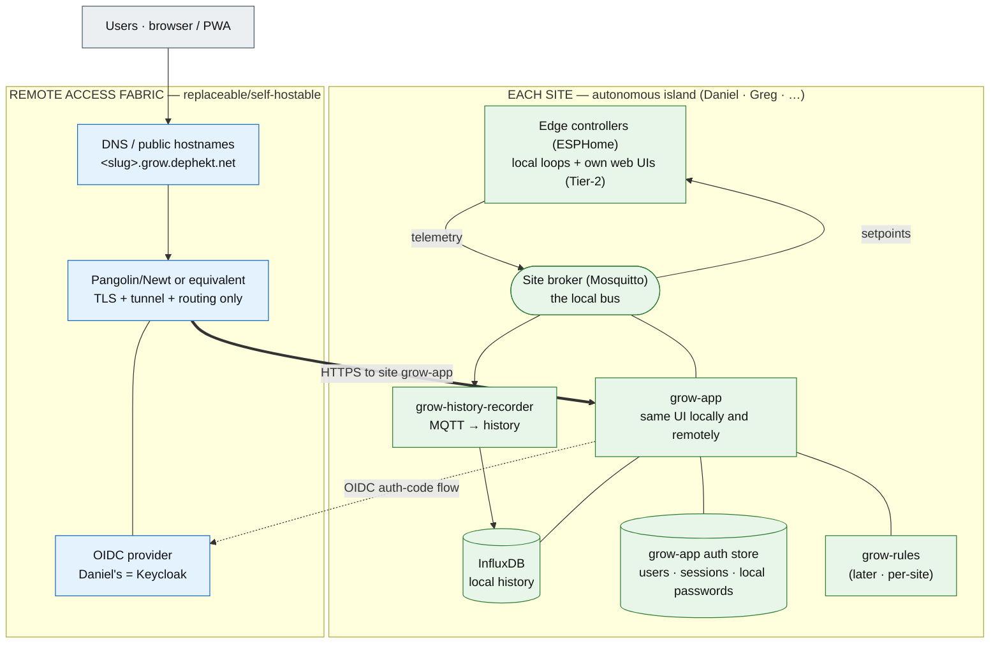
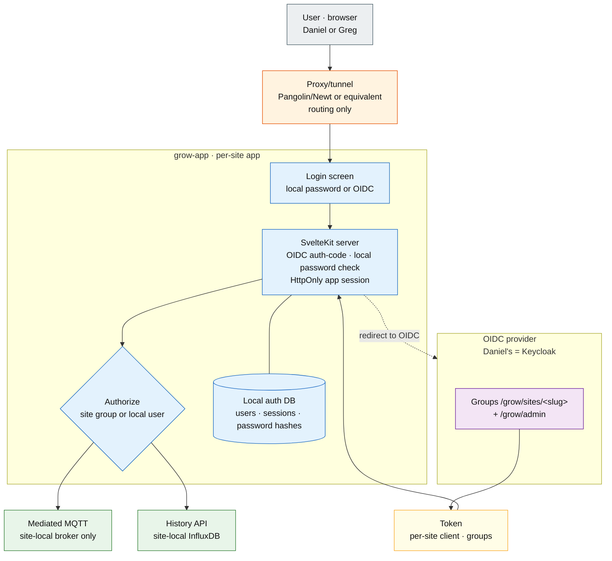

# Grow Control System

Design brief · phase 1 planning artifact

**Scope:** Replace Home Assistant as the grow frontend with an MQTT-based,
multi-site, industrial-style control system. **Sites:** Daniel (home) + Greg
(remote, mirrored). **Remote/UI:** the same per-site grow-app served locally
and, when enabled, at `<site-slug>.grow.dephekt.net`.
**Status:** Phase 1 deployed locally + site OTA shipped

## About this document

!!! note ""
    Self-contained design brief for the grow control system. A downstream
    planning agent (or future-me) should be able to read this end-to-end and
    derive a build plan without recovering context from chat. It follows four
    moves:

    1.  **Establish context** — why move off HA, and the framing principle.
    2.  **Pin decisions** — choices already made, with rationale.
    3.  **Surface the shape** — topology, layers, the MQTT/auth/fleet planes.
    4.  **Track open threads** — the forks still to resolve before the relevant
        implementation phase.

## Status snapshot

!!! note ""
    **Decisions pinned:** 31  ·  **Open forks:** 4  ·  **Deferred / out of scope:** 5
    ·  **Phases sketched:** 8

    **Status:** architecture shape revised around self-contained sites. Each
    site owns grow-app, broker, local history, and app-owned login; central
    infrastructure is only routing and identity. Pangolin/Newt remains a
    proxy/tunnel path, while grow-app handles OIDC, local sessions, and local
    fallback credentials. **Phase 1 is deployed locally:** Daniel's site broker
    is deployed as the `media-stack/mqtt` Mosquitto stack, ESPHome configs
    publish under `grow/daniel-home/#`, and `grow-app` is running as the
    LAN-local `media-stack/grow` site HMI on port `3080`. Site-mode
    channel-aware firmware updates are shipped through private
    `stackdrift-firmware` packages and the grow-app Device Settings update
    panel. Remaining Phase 1 work is HMI polish and real-kiosk ergonomics.
    See [Grow app Phase 1](grow-app-phase-1.md).

------------------------------------------------------------------------

## 1. Goal & context

Home Assistant is being dropped as the **high-level frontend**. The friction is
specifically its **automations** and **dashboards** at the customization level
this needs. HA actually conflates three concerns; only two are the problem:

| Concern | What it is | HA today | Verdict |
|---|---|---|---|
| Transport / state bus | the message fabric | HA's Mosquitto add-on | keep the *function*, own it (it's just MQTT) |
| Control logic / automations | "if VPD>X do Y", crop steering, schedules | HA automations (painful) | **replace** |
| Presentation | dashboards | Lovelace (painful) | **replace** |

Key separation: **MQTT discovery and "using HA" are independent.** Controllers
can keep emitting HA discovery (so an HA instance *could* attach for a glance or
voice) while HA is **not in the critical path** — an optional observer, not a
dependency.

The end state: a "more industrial control system" — collapse layers down to the
ESPHome / ESP-IDF edge, an MQTT spine, a small purpose-built supervisory layer,
and a touch-friendly PWA (phone + M5Stack Tab5) that is the same app locally and
remotely. Remote access may arrive through Pangolin/Newt, but grow-app owns
login and authorization through OIDC plus local fallback credentials.

!!! note "Positive framing — an open, self-hostable Pulse"
    The model to beat is **Pulse Grow**: hubs + ESP-based sensors + a slick app,
    but **cloud-only** — network down means no local management and data gaps,
    purely to enforce vendor lock-in (their devices *could* speak MQTT to your
    own broker; they won't, because lock-in is the business). This system is the
    open inversion: sensors on open controllers that do C2 through a **local**
    broker and keep working offline, with **opt-in** secure remote access to the
    exact same local app. The remote access fabric is **self-hostable** —
    anyone can bring their own OIDC provider, tunnel/proxy, and DNS.
    Anti-lock-in is the thesis, not a feature.

## 2. Organizing principle — autonomous site islands

Borrowed from real SCADA/PLC practice: the **control loop runs at the edge**,
close to the sensors/actuators, so the process survives the network, the app,
and the operations center going down. The supervisory layer only sets
**setpoints** and **observes**.

Two consequences that shape everything:

- **Each *site* is an autonomous control island.** Greg's grow must keep running
  if Daniel's house, the WAN, the IdP, or Pangolin is down. The central side is
  an *access fabric*, not a runtime dependency.
- **A clean degradation ladder** falls out of this:

## 3. Topology

**Symmetric: N autonomous site islands + an optional remote-access fabric.**
Every site is the same shape — edge controllers + local broker + grow-app +
local history + grow-rules later. No site is special. The central side does not
own the canonical UI, broker, or history database; it provides DNS, TLS, tunnel
routing, and OIDC identity.

Daniel's site stack **co-locates on media-server today**; lifting it to
dedicated hardware (the repurposed HA Pi 4) later is a pure deploy-target change
over a remote Docker context. Greg's site uses the same unit with a different
site slug, local broker, local history volume, and OIDC client.

## 4. Layers & components

- **Edge (per site):** ESP32/ESPHome controllers own sensors + actuators, run
  the local control loop, serve their own `web_server` UI, and speak MQTT
  (discovery + LWT). The existing AtomS3U bench rig (CO2L/MLX90640/QMP6988) is
  the prototype.
- **Bus (per site):** Mosquitto. A **site-local broker** per site for autonomy.
  There is no central broker in the core v1 architecture.
- **Site hub (per site):** a cheap always-on box (Pi 5 / N100) running local
  Mosquitto + `grow-app` + InfluxDB + `grow-history-recorder` + `grow-rules`
  later. Daniel's media-server doubles as his site hub.
- **Remote access fabric:** Pangolin/Newt or an equivalent tunnel/proxy, DNS,
  TLS, and an OIDC provider. This layer routes to grow-app; it is not the app's
  authorization engine.
- **Presentation:** the same grow-app PWA for LAN and remote; the Tab5 kiosks
  the local URL, remote users visit `<slug>.grow.dephekt.net`, and controller
  web UIs remain Tier-2.

**One app, one site unit.** `grow-app` is a single codebase deployed per site.
It talks to that site's broker and history database, owns its own app session,
and can be reached over LAN or through a remote proxy. There is no separate
central/multi-tenant grow-app in v1.

## 5. The control plane — MQTT

- **Contract = ESPHome's native MQTT conventions.** ESPHome's `mqtt:` already
  gives per-entity state topics, command topics for controllable entities,
  birth/will (LWT) availability, and optional HA discovery — all free. Adopt
  that as the system contract; make the **bridges conform** to the same shape.
- **Topic namespace carries the site:** `grow/<site>/<device>/…` with
  `<site>` ∈ {`daniel-home`, `greg-home`}. Load-bearing for site isolation and
  portable deployment.
- **Setpoints are retained** so a rebooting controller/app recovers desired
  state; LWT marks devices offline (fixes the gap in the Pulse pattern, which
  leans on HA's timeout).
- **Bridges** (for non-ESP-native gear) publish the same shape:
    - **AC Infinity** — a standalone bridge lifting `ACInfinityClient`.
    - **Pulse Labs** — the AppDaemon app rewritten as a plain MQTT publisher.

## 6. Identity & access

!!! note ""
    Login is enforced by grow-app itself for both LAN and remote access once
    the auth phase lands. The IdP is the normal path, but local app sessions and
    local fallback passwords keep a site usable when WAN or IdP access is down.
    Do not copy, sync, or cache Keycloak/OpenLDAP passwords into grow-app.

- **App-owned sessions.** `grow-app` is a confidential OIDC client and owns its
  own HttpOnly session cookie. Existing sessions use a rolling 30-day lifetime
  and continue when the IdP is unavailable.
- **Per-site OIDC client.** Each site has its own client ID/secret and redirect
  URIs for the public site URL plus configured LAN origins. Keycloak is
  Daniel's provider; a self-hoster can point the site at any compatible OIDC
  provider.
- **Site scope from groups.** Access is granted by OIDC group membership such
  as `/grow/sites/<slug>` plus a global admin group such as `/grow/admin`.
  All authorized users have full site control in v1; viewer/operator roles are
  deferred.
- **Local admin bootstrap.** Deployment provides an initial local admin
  password or password hash through a secret. On first boot, grow-app stores a
  local password hash in its auth database and never keeps the bootstrap secret
  as the source of truth.
- **Local fallback passwords.** After successful OIDC login, a user may opt in
  to a separate grow-app local password. That fallback remains usable until a
  local admin disables it in grow-app, even if the IdP is unavailable.
- **Proxy independence.** Pangolin/Newt routes traffic to grow-app with Pangolin
  SSO disabled for grow resources. If Pangolin is replaced, the app auth model
  does not change.

The access decision, end to end:

## 7. Fleet & firmware (GitOps for ESPHome)

- **Shared package + per-device substitutions.** A common `grow-controller`
  ESPHome package (from the `esphome-components` monorepo) included by a thin
  per-device YAML that only sets substitutions (`site`, `device_id`,
  `environment`, I²C addresses, wifi secret ref). "Mirrored setups" = identical
  packages, per-site substitutions.
- **Git is the source of truth;** an ESPHome dashboard on each site hub pulls +
  OTA-flashes its local devices; Daniel reaches Greg's over Tailscale. Per-site
  `secrets.yaml` (wifi) lives on the hub, never in git.
- **Release packages are the app-facing OTA source.** `grow-fleet` publishes
  compiled firmware as private GHCR OCI artifacts under
  `ghcr.io/dephekt/grow-fleet-firmware-*`. Stable packages come from firmware
  tags; edge packages come from successful `main` builds. Manifests include
  channel, project/package identity, node/device IDs, source SHA, chip family,
  artifact filenames, checksums, and release/changelog summaries.
- **grow-app owns the human update workflow.** Site-mode grow-app now exposes a
  Device Settings firmware update panel. It stores per-device selected channel,
  resolves the latest stable/edge package, serves a local ESPHome update
  manifest and checksum-validated binary proxy, triggers the device update-check
  button when discovered, and publishes the non-retained MQTT update install
  command for per-device Apply. Central/remote mode still needs to delegate the
  update request to the target site's local app/hub so a remote user never needs
  direct browser-to-device LAN access.
- **Provisioning Greg:** flash proven firmware at Daniel's first, ship/install,
  connect wifi (improv / per-site secret). "Buy the same sensors, flash, plug
  in."

## 8. Reuse vs rebuild

| Keep / own | Reuse (don't rewrite) | Ditch |
|---|---|---|
| Mosquitto (own the broker) | AC Infinity `ACInfinityClient` → bridge | HA as frontend |
| HA MQTT discovery as an *optional* shim | Pulse discovery/device modeling → standalone bridge | HA automation engine |
| ESPHome `web_server` local UIs (already have) | ESPHome components (mlx90640, scd4x_*, ezo_types, grow_env_monitor) | HA as a hard dependency |
| Tailscale + Pangolin/Keycloak (already run) | The AtomS3U bench rig as prototype | (later) AC Infinity's cloud role |

------------------------------------------------------------------------

## 9. Decisions pinned

1.  decided Drop HA as frontend **and** as the automation engine.
2.  decided Own the MQTT broker (Mosquitto); it's the system spine.
3.  decided Keep HA MQTT discovery as an optional compatibility shim; HA never in the critical path.
4.  decided Control loops run at the **edge** (ESPHome); supervisory layer only sets setpoints + observes.
5.  decided Each **site** is an autonomous control island; central = access fabric only; no site depends on central to run.
6.  decided MQTT contract = ESPHome's native MQTT conventions; bridges conform to it.
7.  decided Per-controller ESPHome `web_server` UI is the guaranteed Tier-2 fallback (already in use).
8.  decided **One** `grow-app` codebase, deployed per site. There is no central/multi-tenant grow-app in v1.
9.  decided Tab5 = Tier-1 local HMI; it kiosks the **local** grow-app instance. No second native UI.
10. decided Per-site hub (mini-PC) runs local Mosquitto + grow-app + InfluxDB + history recorder + grow-rules later; Daniel's media-server doubles as his hub.
11. decided Remote human access = Pangolin/Newt or equivalent for TLS/tunnel/routing only; auth is grow-app's own OIDC/session layer, not a proxy gate.
12. decided Site identity = slug/owner; namespace `grow/<site>/…`; OIDC **groups** grant site scope (`/grow/sites/<slug>` plus `/grow/admin`). Viewer/operator roles are deferred.
13. decided `grow-rules` (crop steering / irrigation) runs **per-site on the hub** for autonomy; configured/observed through that site's grow-app.
14. decided Fleet = GitOps ESPHome packages + per-device substitutions; per-site dashboard over Tailscale; secrets per-site, not in git.
15. decided "Environment" is logical + nestable (room → tents); device→environment mapping is **soft** (app config); firmware publishes by stable device id.
16. decided Integrate AC Infinity now via a lifted-client MQTT bridge — caveat it's cloud-only + poll-only (the soft spot); flag eventual replacement with ESP-driven local control.
17. decided Rewrite Pulse as a standalone MQTT bridge (drop AppDaemon/HA).
18. decided Time-series backend = **InfluxDB per site** for history/charts. "Current state" stays retained MQTT; historical data is written by a separate MQTT-to-history sidecar.
19. decided Human auth = grow-app is a confidential **per-site OIDC client**. Pangolin drops `auth.sso-enabled` for grow resources and serves routing only; the app rejects anonymous requests itself.
20. decided **Local site access also requires app login once auth lands.** Resilience comes from grow-app's local sessions, bootstrap local admin, and opt-in local fallback passwords, not from open LAN access.
21. decided `grow-app` is a **server-capable framework** (SvelteKit BFF), **not** a static SPA + separate API. Tokens and password checks stay server-side; the browser holds only an HttpOnly session cookie.
22. decided **No site is special.** Every site (Daniel's included) is the same unit: edge + local broker + grow-app + local auth DB + local history + grow-rules later. Daniel's site stack can lift from media-server to a Pi/N100 without changing the architecture.
23. decided **Remote access is self-hostable and replaceable.** OSS repos; anyone can point a site at their own OIDC provider and proxy/tunnel. Pangolin/Keycloak are Daniel's deployment choices, not hardcoded product dependencies.
24. decided **Config-as-source-of-truth; the UI is a generator over it.** Site identity, broker credentials, history credentials, OIDC metadata, redirect origins, and bootstrap admin secret are deployment config. UI setup paths may generate the same artifacts later.
25. decided **grow-app frontend = SvelteKit (Svelte 5).** Resolves fork 3. Chosen over Next.js for lower boilerplate (a non-frontend owner can read and maintain the source), language-native reactivity that suits live MQTT telemetry (a value arriving → the UI updating is nearly free), and lighter bundles for the Tab5 kiosk + phones. The one real cost — coding agents blending deprecated Svelte 4 idioms with Svelte 5 **runes** — is mitigated by a Svelte-5-only guardrail lifted into grow-app's `AGENTS.md` at scaffold time (see §14) plus a pinned `svelte@^5` major. The server-capable BFF architecture (decision 21) is unchanged: SvelteKit *is* the server, in two run-modes (decision 8).
26. decided **Firmware packages are first-class app updates.** Private GHCR OCI firmware packages are not only a CI artifact store; grow-app uses them as the source of available controller updates in site mode. Device Settings compares installed controller firmware against selected-channel package manifests, surfaces version/source/changelog metadata, and supports targeted per-device Apply.
27. decided **History ingestion is a sidecar.** `grow-history-recorder` subscribes to local MQTT and writes numeric sensors plus binary sensor states to site-local InfluxDB. It does not record command intents, buttons, text entities, or diagnostic chatter in v1.
28. decided **OIDC site scope comes from groups.** Use groups like `/grow/sites/<slug>` for site access and `/grow/admin` for global admin. Per-site viewer/operator roles are YAGNI for v1.
29. decided **Bootstrap local admin is required.** Deployment provides an initial admin password or hash via secret/env; grow-app stores a local hash on first boot so IdP outages never lock out site administration.
30. decided **OIDC users may set a separate local fallback password.** This is opt-in after successful OIDC login and remains valid until disabled locally. Do not sync or cache OpenLDAP/Keycloak passwords.
31. decided **Existing app sessions survive IdP outages.** Use a rolling 30-day session by default; new OIDC logins fail cleanly while the IdP is unavailable.

## 10. Open threads / forks

1.  open **Site-hub hardware** — Pi 5 vs N100 mini-PC (N100 has more headroom for local InfluxDB retention and charts; Pi is cheaper/lower-power). Applies to Daniel too now (decision 22): the repurposed HA **Pi 4** is the leading candidate for his site hub, which also retires HA on that box.
2.  open **Local auth UX details** — exact login screen layout, local password setup flow, recovery copy, and admin disable affordances. Policy is pinned; UI wording and ergonomics still need design.
3.  resolved **grow-app framework — SvelteKit (Svelte 5).** Resolved by decision 25. Both finalists were server-capable (BFF pinned, decision 21); SvelteKit won on lower boilerplate, native reactivity fit for live telemetry, and lighter bundles for the Tab5. Agent Svelte-4/5 idiom-mixing is mitigated by the §14 guardrail + pinned Svelte major.
4.  resolved **Central-broker resilience** — resolved by decision 22: there is no central broker in the v1 core architecture. Each site runs its own local broker and history.
5.  open **AC Infinity takeover depth** — front the cloud as-is vs progressively replace its fan/relay role with local ESP control (ties to decision 16).
6.  open **History retention/downsampling** — InfluxDB placement and ingestion are pinned; raw retention windows, downsampling tasks, and chart query limits still need sizing after real data volume is observed.

## 11. Out of scope (for now)

- deferred Crop-steering / irrigation **algorithms** (VPD curves, dryback targets, schedules) — pinned until the bus + app shape is real. The seam is clean: `grow-rules` just publishes setpoints.
- deferred Replacing AC Infinity hardware with ESP-driven fans/relays.
- later Voice assistants / HA-app niceties (possible later via the discovery shim).
- later Live camera/video UI (the MLX thermal is sensor telemetry; streaming is separate).
- later Billing / seat management beyond a Keycloak group for Greg.

## 11.5. Maintenance notes

- deferred **Atlas EC calibration entity
  names before ESPHome 2026.7.0:** `configs/atlas-hydro-kit.yaml` currently has
  `EC Cal Low (1413 µS/cm)` and `EC Cal High (5000 µS/cm)`. ESPHome 2026.5.1
  warns that ASCII `/` is reserved as a URL path separator and auto-rewrites it
  to Unicode fraction slash `⁄`; this becomes a hard error in ESPHome 2026.7.0.
  Rename those labels to use `µS⁄cm` explicitly before upgrading ESPHome.

## 12. Phase plan

- **Phase 0 — site broker + edge telemetry.** done
  Stand up Daniel's **site broker** on media-server; add `mqtt:` (discovery +
  LWT) to the AtomS3U rig pointed at the site broker (`grow/daniel-home/#`);
  prove telemetry flows + retained setpoints round-trip.
- **Phase 1 — grow-app v1 (site mode).** deployed locally + OTA shipped
  Local broker → server-side MQTT session → retained/live entity cache → SSE →
  responsive PWA is running as `media-stack/grow` on Daniel's LAN. Device
  Settings includes per-device stable/edge firmware update orchestration through
  `grow-fleet` packages. Remaining work is HMI polish, physical Tab5 validation,
  and low-priority firmware workflow hardening. Detailed plan:
  [Grow app Phase 1](grow-app-phase-1.md).
- **Phase 2 — app-owned auth + remote access.** Add grow-app local auth storage,
  bootstrap admin, local login/logout, per-site OIDC client support, group-based
  site authorization, opt-in local fallback passwords, and Pangolin/Newt routing
  with Pangolin SSO disabled for grow resources.
- **Phase 3 — local history + Mission Control trends.** Deploy per-site
  InfluxDB and `grow-history-recorder`; add grow-app server-side history query
  APIs and chart surfaces. Keep browsers isolated from direct InfluxDB access.
- **Phase 4 — bridges.** AC Infinity (lift client) + Pulse (rewrite), both
  emitting the ESPHome MQTT shape + discovery.
- **Phase 5 — Greg's site.** Site hub (local Mosquitto + grow-app + InfluxDB +
  history recorder), per-site OIDC client, Keycloak group
  `/grow/sites/greg-home`, mirrored hardware shipped/flashed.
- **Phase 6 — fleet polish.** Any batch update UX, remote-path update smoke
  tests, and Mission Control refinements. Site-mode per-device firmware updates
  are already shipped.
- **Phase 7 — grow-rules.** Crop steering / irrigation per-site on the hub.

------------------------------------------------------------------------

## 13. Pointers & references

- **ESPHome monorepo:** `git@github.com:dephekt/esphome-components.git` —
  components (mlx90640, scd4x_alerts/stats, ezo_types, grow_env_monitor,
  m5cores3_*) + the AtomS3U bench config + the local dev loop. PR flow via `gh`.
- **Pulse pattern:** `~/dev/pulse-sensors-appdaemon` — device-level HA discovery
  (`homeassistant/device/<id>/config`), `via_device` hub→sensor model,
  read-only, **no LWT** (to improve in the rewrite).
- **AC Infinity:** `~/dev/homeassistant-acinfinity` — `ACInfinityClient`
  (`client.py`, pure `aiohttp`, no HA deps), cloud-only (`acinfinityserver.com`),
  email+password → `appId` token, **poll-only**, writes via
  `update_device_controls()`/`update_device_settings()`; modes off/on/auto/timer/
  cycle/schedule/vpd. Liftable into a bridge.
- **Docker / edge:** `~/dev/media-stack` — `core` stack runs Newt + Keycloak;
  resources exposed via `pangolin.proxy-resources.*` labels on the external
  `proxy` network; context `media-server`. Grow resources should use Pangolin
  routing labels **without** `auth.sso-enabled`; auth is handled in grow-app via
  per-site OIDC clients and local fallback credentials.
- **Planes:** Pangolin/Newt or equivalent (human remote routing), Keycloak or
  another OIDC provider (identity), and site-local Mosquitto/InfluxDB/grow-app
  as the operational plane.

------------------------------------------------------------------------

## 14. grow-app frontend conventions — Svelte 5 / SvelteKit

Lift the block below into grow-app's `AGENTS.md` (and echo the headline in its
README) the moment the repo is scaffolded. Its sole job is to neutralize the one
cost of choosing Svelte (decision 25): agents trained on a blend of Svelte 4 and
5 sometimes emit deprecated idioms that "work" in dev but aren't idiomatic and
rot fast.

!!! note "AGENTS.md — Svelte 5 guardrail (ready to lift)"
    **Svelte 5 (runes mode) + SvelteKit only. Never mix Svelte 4 idioms.**
    Before writing any component, confirm `svelte@^5` in `package.json`. Use only
    the right-hand column:

    | Concern | ✅ Svelte 5 | ❌ Svelte 4 (never) |
    |---|---|---|
    | Local reactive state | `let n = $state(0)` | bare `let n = 0` treated as reactive |
    | Derived value | `let d = $derived(n * 2)` | `$: d = n * 2` |
    | Side effect | `$effect(() => { … })` | `$: { … }` reactive block |
    | Props | `let { foo } = $props()` | `export let foo` |
    | Two-way prop | `$bindable()` | implicit `export let` binding |
    | Event handler | `onclick={fn}` | `on:click={fn}` |
    | Child content | `{#snippet}` + `{@render children()}` | `<slot />` |
    | Component events | callback props | `createEventDispatcher` |

    - Shared cross-component state: runes in a `.svelte.js` / `.svelte.ts` module,
      not ad-hoc stores. `svelte/store` stays valid where a store is genuinely the
      right tool — reach for runes first.
    - If you catch yourself typing `$:` or `export let`, stop — that's Svelte 4.
    - Canonical syntax source: the official Svelte 5 docs (svelte.dev/docs;
      svelte.dev/llms.txt for an LLM-oriented dump) — not pre-2024 blog posts or
      training-memory.
    - Pin `svelte` to a `^5` major; never float it backward.
